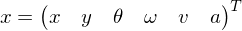
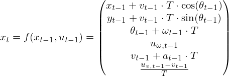
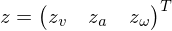
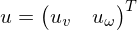
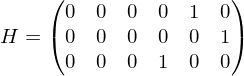
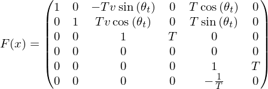
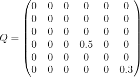
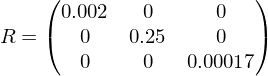
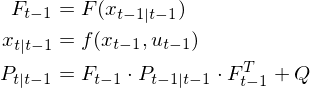
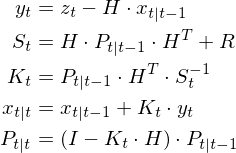

Pose Estimation
===============

Sensor fusion of pose data of our rover `daisy`.

The pose can be measured and estimated by different ROS nodes using different
sensors. For example, the OptiTrack system in our lab provides the position of
the rover very accurately (<1mm). A localization algorithm may use a map of the
lab and the laser scanner to estimate the current position. The rover can
integrate the position using the odometry information from encoders (given an
initial position).

Our rover `daisy` has many more additional sensors on board that can be
fused. This package implements sensor fusion of different pose sources on the
rover (OptiTrack is not fused, but used as reference).

* Any changes or additions to the description above?

    No additional changes.

* List of sources (sensors/data) you use for pose fusion.

    * Velocity from the encoders on the wheels: `/p2os/pose`
    * Acceleration from the sensor on the Raspberry Pi: `/pi/kxtf9/acceleration`
    * Angular velocity from the gyroscope: `/pi/imu3000/angular_velocity`
    * Keyboard control from `/teleop/cmd_vel`

* What sensor fusion algorithm is used? Why?

    The sensors are first synchronized by waiting until a new sample of each
    sensor is received. If some sensors sample faster than others, samples are
    discarded. This leads to a sampling time of 100 ms.

    Messages from the teleop node arrive at intervals of 500 ms if the
    input does not change. We reuse old messages when no new ones have
    been received.

    The model to estimate the position is non-linear, so an extended
    Kalman filter is used.

* State and explain the parameters and model of the algorithm.

    The state of the rover is fully described by it's position, orientation, velocity
    and acceleration.

    

    The next state is calculated with the formulas given in the presentation.

    

    We get observe the acceleration, the angular velocity and the speed
    of the wheels.

    

    The input is the velocity and angular velocity of the rover.

    

    With the observation vector and the state vector, we get the following
    observation matrix H:

    

    To calculate the new covariance matrices, we need the Jacobian of
    the transition model:

    

    For the covariance of the transition and sensors, we use the same
    values as in the presentation, but updated to our smaller
    state vector.

    Covariance matrix of state transition:

    

    Covariance matrix of the sensors:

    

    The predict and update steps are taken from [Wikipedia](https://en.wikipedia.org/wiki/Extended_Kalman_filter).
    They reduce the number of matrix multiplications by reusing certain
    calculations.

    Predict:

    

    Update:

    


Setup
-----

* What devices are used? What should be powered on?

    Powering on the rover and all boards on it is sufficient.

* What settings do you need on the devices? (e.g., on the rover, what
  sensors have to be connected?)

    We are using the gyroscope and the acceleration sensor on the Raspberry Pi
    and encoders on the rover's internal board, so these have to be connected
    and powered on. The internal board (`daisy`) needs to be reset using
    the green switch on the rover.

Usage
-----

The `pose_estimation` node itself is written in Python.

The package also contains a new launch-file ([`fusion.launch`](launch/fusion.launch)) that starts all required nodes:
* [`p2os_driver`](http://wiki.ros.org/p2os_driver) on `daisy`
* [`imu3000`](https://github.com/tuw-cpsg/general-ros-modules/tree/master/drivers/imu3000) and
  [`kxtf9`](https://github.com/tuw-cpsg/general-ros-modules/tree/master/drivers/kxtf9) on `daisy-pi`
* [`pioneer_teleop`](https://github.com/tuw-cpsg/general-ros-modules/tree/master/pioneer_teleop) and
  [`pose_estimation.py`](scripts/pose_estimation.py) on the notebook

`pose_estimation.py` continuously prints the estimated position and orientation.
It also publishes the estimated position under the
topic `/pose_estimation/pose`.
The datatype is
[`Pose`](http://docs.ros.org/api/geometry_msgs/html/msg/Pose.html).

The default arguments defined in `fusion.launch` are set so that it can
be launched without any further arguments:

```bash
roslaunch pose_estimation fusion.launch
```
