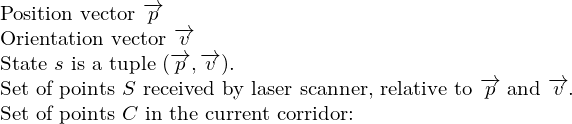
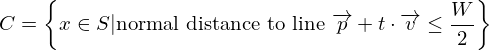
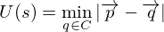
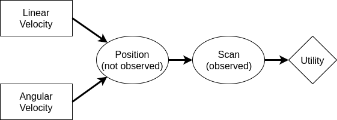

Wanderer
========

Implementation of a simple wanderer taking the path with the farthest distance
(e.g., by analyzing the scan of the laser range finder).

* Formulate the problem (wandering into the direction of the farthest
  distance) as simple decision making. What is the utility function? What is
  the decision network (random variables used, utility, decision)? Explain.

  * The utility function of a state is the minimum distance to the
    next obstacle in a defined corridor in the rover's driving direction.

    
    

    The utility is then defined as follows:

    

    We then calculate the maximum expected utility for a defined set
    of actions (tuples of linear and angular velocities). The state for
    which the utility is calculated is extrapolated from the current position
    and the action under consideration.

    If the utility is smaller than a defined threshold FB, the result
    from the utility function is discarded.
    If the current laserscan contains a point that is further away than
    FB, the rover turns towards this point. If no such point exists, the
    rover turns until it sees such a point.

  * Decision network:

    

    The decision variables are the linear and angular velocity. These
    influence the position of the rover (with some uncertainties and noise),
    which influence the image scanned by the laser scanner.
    This image is also noisy.

* State and explain the decision maker and the implementation.

    Decisions are made whenever a new set of points arrives from the
    laser scanner (`Wanderer.scan_cb`).
    We calculate the expected utility for each combination of angular
    and linear velocities and execute the action with the maximum utility
    if it is higher than some threshold FB.

    The utility is calculated in (`Wanderer.get_utility`). We transform
    the coordinates from the wanderer into a cartesian coordinate system
    and check for each point, if its normal distance to the rover's direction
    is less than the half of the width of the rover.

Setup
-----

* What devices are used? What should be powered on?

    On the rover, powering on all boards is sufficient.

* What settings do you need on the devices? (e.g., on the rover, what
  sensors have to be connected?)

    The wanderer only uses the laser scanner as input data.
    All parameters are set to working default values in the launch file `wanderer.launch`.

Usage
-----

* Which ROS nodes have to be started? Provide the necessary commands
  here. Put links to the sources of the started ROS nodes.

    * [`p2os_driver`](http://wiki.ros.org/p2os_driver) on `daisy`
    * [`wanderer.py`](scripts/wanderer.py) on the notebook.
    * [`hokuyo_node`](http://wiki.ros.org/hokuyo_node) on `daisy`

```bash
$ roslaunch wanderer wanderer.launch
```
